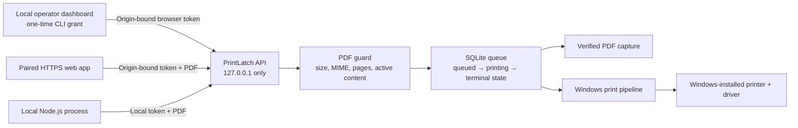

# PrintLatch

**Print PDFs from web apps. Keep the job local.**

PrintLatch is a small, open-source Windows agent that lets an explicitly paired
web app or local Node.js process submit PDF print jobs to printers already
installed in Windows. Documents stay on the machine. There is no PrintLatch
cloud, account, certificate subscription, or agent telemetry.

> Release status: `0.1.1` is Windows 11 x64 only. PDF capture is fully testable
> without a printer. Windows printer discovery and submission use the native
> print pipeline. No label, receipt, raw ESC/POS, ZPL, macOS, or Linux support is
> claimed in this release.

The separate public landing page uses our self-hosted Umami instance for
aggregate page, bounded CTA, section, scroll-depth, and engaged-time events. It
respects Do Not Track and Global Privacy Control, sets no analytics cookies, and
receives neither documents nor activity from installed PrintLatch agents. URLs
are reduced to the landing root plus safe, bounded standard UTM values, and
referrer paths are removed before sending.

[Download](https://github.com/arturict/printlatch/releases/latest) ·
[Security model](docs/security/security-model.md) ·
[API](docs/api.md) ·
[Troubleshooting](docs/troubleshooting.md)

## Why PrintLatch exists

Browsers intentionally do not offer silent access to arbitrary local printers.
Existing workarounds commonly introduce a hosted print service, broad
fleet-management features, certificate deployment, warning dialogs, or a raw
localhost socket. PrintLatch takes a narrower route:

- one Windows user and the printers already installed for that user
- static, unencrypted PDF only
- an explicit five-minute pairing code bound to one browser origin
- rotatable bearer tokens that are never accepted across client types
- a durable local queue with visible states and explicit retry
- a built-in PDF capture target for preview, dry runs, CI, and demos

The research and deliberate exclusions are documented in
[product research](docs/product/research.md) and
[release scope](docs/product/scope.md).

## Architecture



PrintLatch does not listen on LAN interfaces. It does not fetch document URLs.
It does not expose a WebSocket endpoint. Printer names never become shell
commands or process arguments.

## Install

1. Download `printlatch-v0.1.1-windows-x64.zip` and `SHA256SUMS.txt` from the
   [GitHub release](https://github.com/arturict/printlatch/releases/latest).
2. Verify the archive hash:

   ```powershell
   Get-FileHash .\printlatch-v0.1.1-windows-x64.zip -Algorithm SHA256
   ```

3. Extract the archive and run:

   ```powershell
   Set-ExecutionPolicy -Scope Process Bypass
   .\install.ps1
   ```

The installer places the unsigned executable under
`%LOCALAPPDATA%\PrintLatch\bin`, registers a per-user startup task, starts the
agent hidden, verifies `http://127.0.0.1:32191/health`, and opens the local
operator dashboard with a five-minute one-time grant. Use `-NoDashboard` for
unattended installation.

The binary is not code-signed in v0.1. Windows may show a SmartScreen warning.
Verify the published SHA-256 checksum before continuing. No build-provenance
attestation is claimed for v0.1.1.

## First local result

If the dashboard is not already open, run:

```powershell
printlatch dashboard
```

The command verifies the running agent against this local installation, creates
a one-time grant bound to that agent session and the exact loopback dashboard
origin, and opens the URL in the default browser. The token remains in browser
session storage. A fresh dashboard grant rotates the same operator credential,
invalidates its previous token, and retains its queue history.

The first-run path deliberately avoids physical output:

1. confirm the agent session and detected targets
2. validate and inspect the built-in static one-page PDF
3. explicitly confirm a job to `PrintLatch PDF Capture`
4. wait for the queue to report success and verify the local artifact

Windows printers are labeled `discovered`, not verified. A physical test page
becomes optional only after the capture path succeeds. PrintLatch reports
Windows submission state, not proof that paper emerged.

## Pair a web origin

Run this locally:

```powershell
printlatch pair --origin https://app.example --name "Invoice app"
```

Actual output from release candidate `114bf2b` on Windows 11 x64. The local
data path is redacted, and this one-time code is expired:

```text
Pairing code: PL-7D5B0F18-56C7C069-4DDA89E8-8D940CE6
Origin: https://app.example
Expires at (Unix): 1785341691
Agent data: [local path redacted]
```

Paste the code into the named web application. The agent returns a browser token
only when the request's `Origin` exactly matches the origin bound to the code.
Each application grant creates an independent client and job history, even when
its name and origin match an earlier grant.
The code is consumed once.

## Use from Node.js

Create a local-process token. The token is shown only once and expires after at
most 90 days:

```powershell
printlatch clients create --name "Local invoice worker" --days 30
$env:PRINTLATCH_TOKEN = "pl_live_..."
node .\examples\node-print.mjs .\invoice.pdf capture:pdf
```

The example reads the token from the environment. It does not commit, echo, or
hard-code it. See [`@printlatch/sdk`](packages/sdk/README.md) for the browser and
Node.js API.

## Queue semantics

| State | Meaning | Safe next action |
| --- | --- | --- |
| `preview_ready` | Validated PDF is available locally; nothing was printed | Inspect or submit a separate print job |
| `queued` | Waiting for the single local worker | Cancel |
| `printing` | Being handed to the Windows print pipeline | Wait |
| `succeeded` | Windows accepted the submission or capture file was written | Check physical output if applicable |
| `failed` | Submission failed with a bounded diagnostic | Retry, up to three attempts |
| `unknown` | Agent restarted during Windows submission | Inspect first, then retry manually |
| `canceled` | Canceled before submission started | Create a new job if needed |

`succeeded` never claims that paper physically emerged. Windows and printer
drivers do not provide a reliable end-to-end physical-output confirmation.

## Supported in 0.1

| Surface | Status |
| --- | --- |
| Windows 11 x64 | Supported and release-tested |
| PrintLatch PDF Capture | Supported and end-to-end tested |
| Windows-installed A4/Letter document printers | Native submission path; model-specific output remains driver-dependent |
| Static, unencrypted PDF | Supported, max 10 MiB and 100 pages |
| Browser Fetch API | Supported after exact-origin pairing |
| Local Node.js 20+ | Supported with a local-process token |
| Windows 10, Windows ARM64 | Not tested or supported |
| macOS, Linux | Not implemented |
| Label/receipt printers, custom media, raw ESC/POS/ZPL | Not supported |
| URLs, HTML, images, ZIPs, encrypted or active PDFs | Rejected |
| Remote internet-to-printer relay | Not implemented |

See the live [hardware evidence matrix](docs/testing/hardware-matrix.md) for the
exact devices and paths actually exercised.

Real target enumeration from the same Windows 11 x64 release candidate:

```text
capture:pdf  PrintLatch PDF Capture          capture        verified
win:f5a...   Microsoft Print to PDF           windows_local  discovered
win:d116...  Brother MFC-J5340DW Printer      windows_local  discovered
win:c21d...  Adobe PDF                        windows_local  discovered
```

`discovered` means Windows reported the installed driver. It does not claim
that PrintLatch produced physical paper on that device.

## Security summary

- Binds only to `127.0.0.1`, with strict `Host` validation against DNS rebinding.
- No unauthenticated print, document, printer-list, cancel, or retry endpoint.
- Browser tokens require the exact paired `Origin`. The loopback dashboard also
  accepts browser-proven same-origin GETs only when its stored origin exactly
  matches the current loopback Host. Local tokens reject all requests carrying
  an `Origin`.
- Pairing codes are 128-bit, origin-bound, five-minute, and one-time.
- Dashboard grants also require an HMAC-proven local installation and are bound
  to the current agent session, so a listener on the configured port cannot
  capture a grant for a later agent restart.
- CORS and Private Network Access headers are emitted only for `/v1/*` API
  routes. The operator shell and its local recovery command are never readable
  cross-origin.
- Tokens are stored as SHA-256 digests, expire, rotate, and revoke.
- Unknown multipart fields are rejected, so PrintLatch cannot be used as an SSRF
  fetcher.
- Jobs use generated UUID filenames. Supplied filenames never choose a path.
- PDF size, MIME, signature, page count, object count, decoded streams, image
  dimensions, active actions, forms, embedded files, and encryption are bounded
  or rejected.
- Queue transitions are atomic. Interrupted submissions become `unknown` instead
  of being silently replayed.
- No document bodies, tokens, or pairing codes are written to normal logs.
- Agent telemetry is off because no telemetry code exists in the agent, local
  dashboard, or SDK. Landing-page analytics are isolated to the public website.

Read the complete [threat model](docs/security/threat-model.md), including
residual risks around same-user malware, Windows drivers, and physical output.
The [dependency audit](docs/security/dependency-audit.md) records the one
unmaintained compile-time transitive warning and the absence of known
vulnerabilities.
Report vulnerabilities privately using [SECURITY.md](SECURITY.md).

## Troubleshooting and removal

Run:

```powershell
printlatch diagnose
```

Then consult [troubleshooting](docs/troubleshooting.md). To remove the agent:

```powershell
.\uninstall.ps1
```

This removes the executable and startup task but preserves queued documents,
captures, and client records. Use `.\uninstall.ps1 -PurgeData` only when you
intend to remove that local data too.

## Development

Prerequisites:

- Rust 1.94.1
- Node.js 24 or newer
- pnpm 11.7.0
- Docker for the pinned Linux validation path

```powershell
pnpm install --frozen-lockfile
pnpm format:check
pnpm lint
pnpm typecheck
pnpm test
pnpm build

docker run --rm `
  -v "${PWD}:/work" `
  -w /work rust:1.94 `
  cargo test --all-targets
```

The complete gates are listed in [testing](docs/testing/strategy.md), with
[local and self-hosted reproduction commands](docs/testing/local-ci.md).
Contributions are welcome within the documented product boundary.

## License

Apache License 2.0. See [LICENSE](LICENSE).
